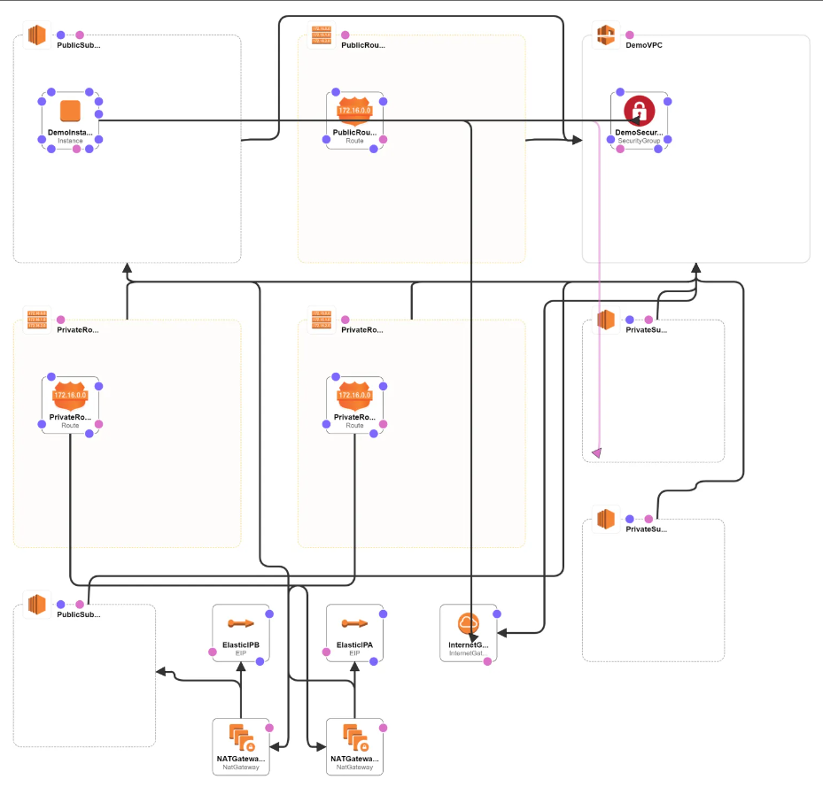

# Custom VPC Creation with Private and Public Subnet , Internet Gateway , NAT Gateway and Elastic IP

## We will cretae : 
- 1 VPC
- 2 Public Subnet and 2 Private Subnet
- 1 Internet Gateway and attach it to VPC
- 1 Public Route table for all the public connectivity – all public traffic goes through internet gateway
- Associate both public subnet to public route table
- 2 elastic IPs that will be used by 2 NAT gateway
- Create two private route table one for each private subnet
- 2 NAT Gateway to provide internet connectivity to our private subnet
- Route private traffic of each subnet in route table via respective NAT gateway
- Associate private subnet to private route table
- And we will have a fully function VPC with internet connection in private as well as public subnet
